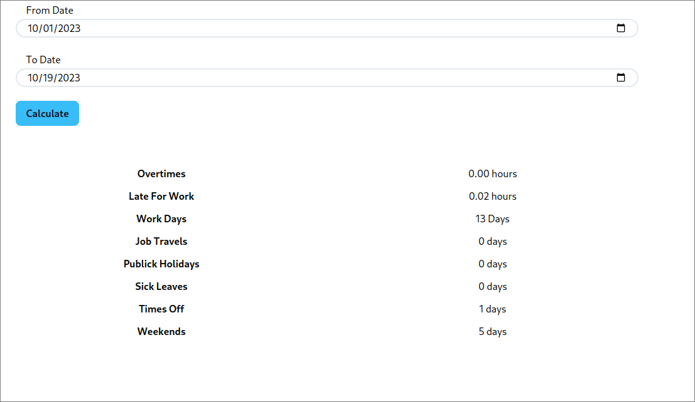

# HMS Hours Management System

This is the front-end for keeping track of your work hours. You can check how many Holidays off you have, sick leaves, public holidays, how many overtimes and late for work you are.
You can select the dates you want to check.

#### You can add 6 different types of days

1. Normal Day
2. Weekend
3. sick leave
4. times off
5. Public Holidays
6. job travel

### Start Now

1. Download this repo
2. [Download the Back end](https://github.com/DrososDro/hms_react)
3. Follow the instructions to run the back end
4. run `npm run dev` to start the server
